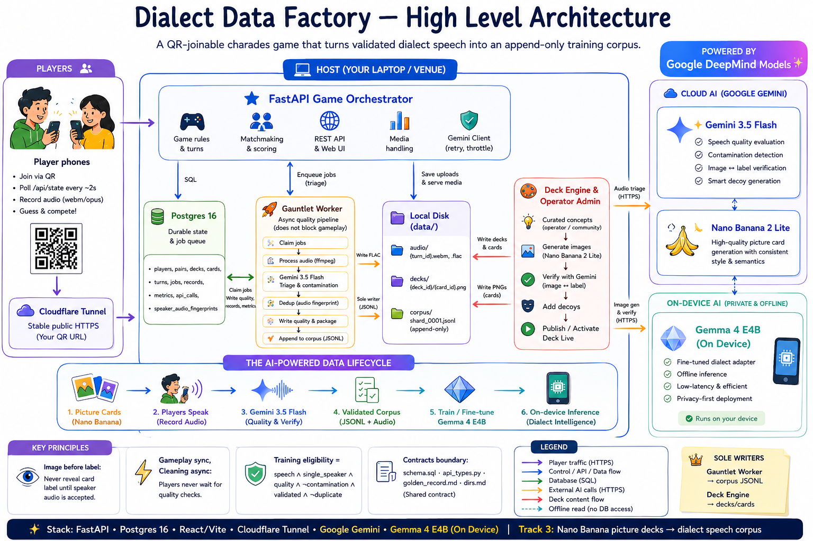

# Neva

Turn a multiplayer charades game into a zero-touch, validated dialect speech-data pipeline.

**Neva** turns a charades game into a zero-touch dialect speech pipeline: strangers
with different mother tongues describe Nano Banana 2 Lite–generated regional
picture decks, partners validate meaning in a shared language, and every
accepted round is cleaned through automated quality, contamination, and
de-duplication gates before it enters an append-only training corpus for
fine-tuning—proving that high-throughput creative generation isn’t a prompt box,
it’s the engine that keeps play fresh while India-scale language data collects
itself.


## Hackathon tracks

Built for the [Google DeepMind Bangalore Hackathon](hackathon-details.md). We compete in:

### Primary — Problem Statement 3: High-Throughput Creative Workflows with NB2 Lite

**Focus technology:** Nano Banana 2 Lite (`gemini-3.1-flash-lite-image`)

Traditional image gen is too slow/expensive for live pipelines. NB2 Lite makes
high-volume, programmatic generation load-bearing. Dialect Data Factory uses it
as an automated regional picture-deck factory: curated concepts → generate →
verify → publish → activate for live play. Throughput, $/image, and reject rate
are first-class demo metrics—not a prompt-box-to-image toy.

Supporting stack from the event AI list: Gemini 3.5 Flash (`gemini-3.5-flash`)
for verification, speech triage, and structured game/ops calls.

### Bonus — Special Prize: Best Use of Gemma 4 (Local-First Agents on Gemma)

**Focus technology:** Gemma On-Device (Gemma 4 E2B & E4B)

Validated speech→label pairs from the game become a same-day local corpus for
an optional QLoRA fine-tune under `tune/` (isolated from Postgres). The demo
claim is the local data loop feeding Gemma—not cloud chat with a local skin.
Tier 2 (train/compare) is cut-first if venue GPU/time does not allow.

**Primary pitch:** Track 3 pipeline velocity and unit economics. Gemma is the
bonus track when the adapter path is green.

Official schedule, rules, judging weights, and prizes: [`hackathon-details.md`](hackathon-details.md).
Living design: [`Design.md`](Design.md). Agent rules: [`AGENTS.md`](AGENTS.md).

## Architecture

- FastAPI backend, served locally and exposed through a tunnel
- Postgres 16 in Docker
- Local disk for audio, decks, and append-only corpus shards
- Independent game, deck-generation, cleaning-worker, and fine-tuning components
- Mobile player UI at `/`, venue TV at `/tv`, operator admin at `/admin`



The frozen integration contracts live in [`contracts/`](contracts/).

## Quick start (Docker demo stack)

Preferred venue/demo path — builds the API, frontend, worker, and migrations
into one image:

1. Copy `.env.example` to `.env`. Set at least:
   - `DATABASE_URL` / Postgres password vars used by Compose
   - `GEMINI_API_KEY` for live decks and gauntlet
   - `DECK_ADMIN_API_KEY` for deck generate/activate and `/admin`
2. Start the stack:
   ```sh
   set -a && source .env && set +a
   docker compose up -d --build
   ```
3. Open:
   - Players: `http://localhost:8000/`
   - Health: `http://localhost:8000/api/health`
   - Venue TV: `http://localhost:8000/tv`
   - Operator admin: `http://localhost:8000/admin`

Runtime blobs stay under `./data` (gitignored). Do not commit audio, decks, or
corpus shards.

### Local API without rebuilding the image

```sh
uv sync --python 3.12 --all-extras
source .venv/bin/activate
docker compose up -d postgres
uv run python -m scripts.apply_schema   # or scripts.apply_migrations
uv run uvicorn app.main:app --reload --host 127.0.0.1 --port 8000
```

## Matchmaking (demo rules)

Players match when they have **different mother tongues** and at least one
**shared speakable language** (`native_lang` ∪ `common_langs`).

For the demo, when English is in that shared set, the pair’s `common_lang` is
**`en`**, so card / option labels stay in English. Both players should include
English in “what else do you speak” for the intended stage path.

Queue rows older than ~30s without a `POST /api/pair/request` heartbeat are
evicted. Nicknames are case-insensitively unique.

## Demo deck control

Whimsical regional Nano Banana decks (not centered product shots). Set the same
`DECK_ADMIN_API_KEY` in the API and operator shell:

```sh
uv run python -m scripts.deck_admin generate build-docs/demo-deck-concepts.example.json
uv run python -m scripts.deck_admin list
uv run python -m scripts.deck_admin show <deck-uuid>
uv run python -m scripts.deck_admin activate <deck-uuid>
```

Add `--dry-run` to `generate` or `activate` to validate without changing data.
Generation finishes in `ready`; only explicit activation makes a deck `live`.
Published image files use the real encoding extension (`.jpg` / `.png` / `.webp`)
from Gemini’s bytes.

Operator UI: paste the admin key at `/admin` for decks, metrics, and redacted
traces. Per-utterance stage walks stay on the CLI:

```sh
uv run python -m scripts.pipeline_view --fixture
# or --turn-id <uuid>
```

See [`phase-plan/wave-3-launch-demo/ADMIN-DEMO-RUNBOOK.md`](phase-plan/wave-3-launch-demo/ADMIN-DEMO-RUNBOOK.md).

## Gemma training pipeline (bonus track)

The cleaning gauntlet writes **training-eligible** golden records into
`data/corpus/*.jsonl` with matching FLAC under `data/audio/`. The isolated
`tune/` harness never opens Postgres or Gemini—it only reads that local corpus.

Nothing in game code changes for a “real” run: the same three steps
(`prepare` → `train` → `compare`) swap the synthetic fixture for `data/corpus`.
With a small eligible set (for example 8 real records → ~6 train / 2 holdout),
raise epochs so the adapter clearly diverges from base on stage—this
demonstrates the learning loop on genuine dialect speech, not generalization.

### One-shot script

From the repo root (WSL2, GPU, model already cached offline):

```bash
chmod +x tune/run-real-demo.sh
./tune/run-real-demo.sh
```

Defaults: `TUNE_MODEL_ID=unsloth/gemma-4-E4B-it-unsloth-bnb-4bit`,
`HF_HUB_OFFLINE=1`, `TUNE_EPOCHS=40`, `TUNE_GRAD_ACCUM=2`, artifacts under
`~/gemma-runs/real-<timestamp>/`. Override with env vars (`REPO_ROOT`,
`CORPUS_DIR`, `SKIP_COMPARE=1`, etc.).

### Manual steps

```bash
export TUNE_MODEL_ID="unsloth/gemma-4-E4B-it-unsloth-bnb-4bit"
export HF_HUB_OFFLINE=1 TRANSFORMERS_OFFLINE=1
export TUNE_EPOCHS=40 TUNE_GRAD_ACCUM=2

run_root="$HOME/gemma-runs/real-$(date -u +%Y%m%dT%H%M%SZ)"
prepared="$run_root/prepared"
artifacts="$run_root/full"
mkdir -p "$run_root"

uv run --project tune python -m tune.prepare \
  --corpus "$PWD/data/corpus" \
  --data-dir "$PWD/data" \
  --output "$prepared"

uv run --project tune python -m tune.train \
  --train "$prepared/train.jsonl" \
  --dataset-manifest "$prepared/dataset_manifest.json" \
  --output "$artifacts"

uv run --project tune python -m tune.compare \
  --holdout "$prepared/holdout.jsonl" \
  --dataset-manifest "$prepared/dataset_manifest.json" \
  --adapter "$artifacts/adapter" \
  --artifact-manifest "$artifacts/artifact_manifest.json" \
  --samples 2
```

Optional live-mic beat: capture with `tune/capture_demo_audio.ps1`, then
`python -m tune.demo` with `--live-audio`, `--native-language`, and the
verified `$artifacts/adapter`. Full smoke/fixture docs: [`tune/README.md`](tune/README.md).

**Judge framing:** a handful of real rows proves corpus → adapter on authentic
speech; grow the append-only corpus and re-freeze for any generalization claim.

## Repository layout

```text
app/          FastAPI app, game core, Gemini client, admin APIs
contracts/    Frozen API, database, data-record, and directory contracts
deckgen/      Nano Banana deck-generation CLI
worker/       Async cleaning-gauntlet process
tune/         Isolated Gemma LoRA harness
frontend/     React/Vite player + TV + /admin surfaces
scripts/      Schema, deck admin, pipeline view, bootstrap helpers
build-docs/   Briefs, architecture notes, demo concept JSON
docs-assets/  README diagrams and pitch visuals
phase-plan/   Wave orchestration and runbooks
data/         Runtime-only local audio, decks, and JSONL corpus shards
```

## Scope discipline

Do not add game behavior to the frontend; it renders the server-owned state
contract. Do not change a contract without coordinating both backend and
frontend owners. Keep Gemini model IDs in `app/models.py` and prompts in named
modules (`deckgen/prompts.py`, `worker/prompts.py`).

## License

This project is licensed under the [GNU Affero General Public License v3.0](LICENSE)
(AGPL-3.0).
