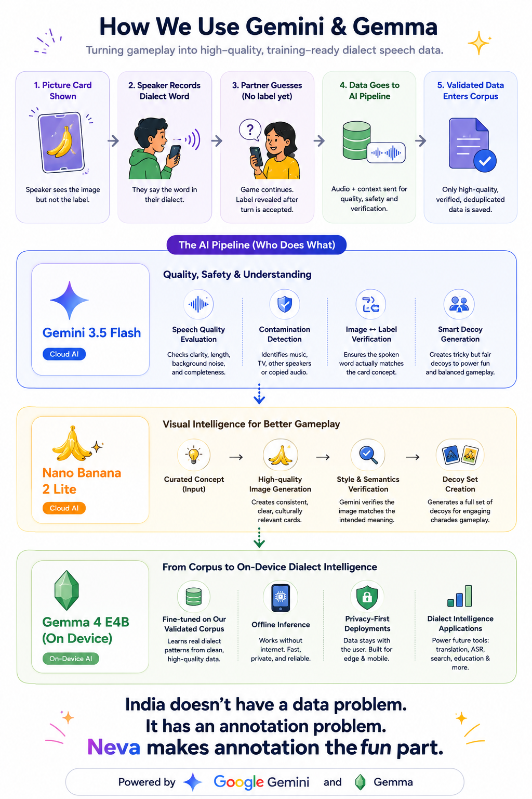

# Neva

**Can the outcome of a communication game supply speech supervision for free?**

Neva tests whether *communicative success* — whether a listener recovers the intended
concept, and *which* listener recovers it — can replace paid annotation for building
dialect-labelled speech corpora. Each record pairs an audio utterance with a deck-owned
concept label and a human partner's confirmation that the meaning landed: no transcript, no
separate annotation pass.

Neva began as a build at the **Google DeepMind Bangalore Hackathon**. The hackathon proved the
loop *runs* end-to-end across languages; whether its outcomes are a usable supervision signal —
and whether the same loop run *within* a language yields dialect labels for free — is the open
research question this repo now tracks.

> **Status:** pre-pilot research artifact. This is a paper-and-dataset effort, not a product.
> Scope is deliberately bounded.

- **Research question & prior work:** [`docs/RESEARCH.md`](docs/RESEARCH.md)
- **Phased plan & go/no-go gates:** [`docs/ROADMAP.md`](docs/ROADMAP.md)
- **Data availability:** no dataset released yet. Pilot data will be released **CC-BY-4.0**
  (see [Roadmap](docs/ROADMAP.md), Phase 3).
- **Citing Neva:** no preprint yet — see [Citation](#citation).

---

## The research question

In a dialect-diverse language (Assamese: Kamrupi, Goalpariya, Central/Nagaon, Eastern/Sivasagar,
plus contact varieties Nagamese and Sadri), can gameplay outcomes act as:

- **H1 — a quality signal.** Does *guess-success* (a listener correctly recovering the intended
  concept) predict human-rated utterance quality better than an off-the-shelf ASR-confidence
  baseline (Whisper / MMS)?
- **H2 — a dialect signal.** Does *who* succeeds leak dialect? If a Goalpariya speaker's clue is
  solved quickly by Goalpariya listeners and slowly by Sivasagar listeners, the differential
  accuracy/latency across listener geography functions as a dialect label — and yields a
  perceptual distance matrix between varieties at no annotation cost.

**H2 is the contribution; H1 is the sanity check that makes H2 credible.** No prior work we found
uses cross-listener comprehension asymmetry as a dialect signal — see
[`docs/RESEARCH.md`](docs/RESEARCH.md) for the full landscape and where Neva does and does not
break new ground.

### Built vs. proposed

The current pipeline validates a concept when two players with **different mother tongues** agree
on it through a **shared bridge language** (English in the demo). That is cross-*language*
validation, and it is what the hackathon build demonstrates.

The dialect thesis (H2) is **a direction, not a built feature.** Because the current loop shares
a bridge language, it does not yet measure dialect asymmetry — dropping the bridge to play
*same-language, across dialects* is the defining change from hackathon artifact to research
pilot. See [`docs/ROADMAP.md`](docs/ROADMAP.md), Phase 1.

**Two independent meanings of "validated":** meaning is validated when a partner with a different
mother tongue correctly guesses the concept; audio is validated by automated speech-quality,
contamination, and de-duplication gates.



---

## How it works

Strangers with different mother tongues describe Nano Banana 2 Lite–generated regional picture
decks; partners guess the concept in a shared language; automated quality gates clean the
accepted audio before eligible records enter an append-only local training corpus. Fresh regional
decks keep play useful, so **play produces the corpus — no annotator, no transcription pass.**

### Architecture

- FastAPI backend, served locally and exposed through a tunnel
- Postgres 16 in Docker
- Local disk for audio, decks, and append-only corpus shards
- Independent game, deck-generation, cleaning-worker, and fine-tuning components
- Mobile player UI at `/`, venue TV at `/tv`, operator admin at `/admin`


The frozen integration contracts live in [`contracts/`](contracts/).

### Matchmaking (demo rules)

Players match when they have **different mother tongues** and at least one **shared speakable
language** (`native_lang` ∪ `common_langs`). For the demo, when English is in that shared set,
the pair's `common_lang` is **`en`**, so card / option labels stay in English. Both players
should include English in "what else do you speak" for the intended stage path.

Queue rows older than ~30s without a `POST /api/pair/request` heartbeat are evicted. Nicknames
are case-insensitively unique.

---

## Reproduce it

### Quick start (Docker demo stack)

Preferred venue/demo path — builds the API, frontend, worker, and migrations into one image:

1. Copy `.env.example` to `.env`. Set at least:
   - `DATABASE_URL` / Postgres password vars used by Compose
   - `GEMINI_API_KEY` for live decks and gauntlet
   - `DECK_ADMIN_API_KEY` for deck generate/activate and `/admin`
2. Start the stack:
   ```sh
   set -a && source .env && set +a
   docker compose up -d --build
   ```
3. Open:
   - Players: `http://localhost:8000/`
   - Health: `http://localhost:8000/api/health`
   - Venue TV: `http://localhost:8000/tv`
   - Operator admin: `http://localhost:8000/admin`

Runtime blobs stay under `./data` (gitignored). Do not commit audio, decks, or corpus shards.

### Local API without rebuilding the image

```sh
uv sync --python 3.12 --all-extras
source .venv/bin/activate
docker compose up -d postgres
uv run python -m scripts.apply_schema   # or scripts.apply_migrations
uv run uvicorn app.main:app --reload --host 127.0.0.1 --port 8000
```

### Deck control

Whimsical regional Nano Banana decks (not centered product shots). Set the same
`DECK_ADMIN_API_KEY` in the API and operator shell:

```sh
uv run python -m scripts.deck_admin generate build-docs/demo-deck-concepts.example.json
uv run python -m scripts.deck_admin list
uv run python -m scripts.deck_admin show <deck-uuid>
uv run python -m scripts.deck_admin activate <deck-uuid>
```

Add `--dry-run` to `generate` or `activate` to validate without changing data. Generation
finishes in `ready`; only explicit activation makes a deck `live`. Published image files use the
real encoding extension (`.jpg` / `.png` / `.webp`) from Gemini's bytes.

### Per-utterance stage walk

```sh
uv run python -m scripts.pipeline_view --fixture
# or --turn-id <uuid>
```

Operator UI: paste the admin key at `/admin` for decks, metrics, redacted traces, and the local
Gemma training/inference demo. The Tune tab distinguishes the live one-step training proof from
the separately verified full adapter; weak qualitative results keep inference disabled. See
[`phase-plan/wave-3-launch-demo/ADMIN-DEMO-RUNBOOK.md`](phase-plan/wave-3-launch-demo/ADMIN-DEMO-RUNBOOK.md).

### Gemma training pipeline

The cleaning gauntlet writes **training-eligible** golden records into `data/corpus/*.jsonl` with
matching FLAC under `data/audio/`. The isolated `tune/` harness never opens Postgres or Gemini —
it only reads that local corpus.

Nothing in game code changes for a "real" run: the same three steps (`prepare` → `train` →
`compare`) swap the synthetic fixture for `data/corpus`. With a small eligible set (for example
8 real records → ~6 train / 2 holdout), epochs are raised so the adapter converges on the
available examples. This demonstrates the corpus→adapter loop end-to-end on authentic speech; it
is not a generalization claim.

<details>
<summary>One-shot script and manual steps</summary>

From the repo root (WSL2, GPU, model already cached offline):

```bash
chmod +x tune/run-real-demo.sh
./tune/run-real-demo.sh
```

Defaults: `TUNE_MODEL_ID=unsloth/gemma-4-E4B-it-unsloth-bnb-4bit`, `HF_HUB_OFFLINE=1`,
`TUNE_EPOCHS=40`, `TUNE_GRAD_ACCUM=2`, artifacts under `~/gemma-runs/real-<timestamp>/`. Override
with env vars (`REPO_ROOT`, `CORPUS_DIR`, `SKIP_COMPARE=1`, etc.).

```bash
export TUNE_MODEL_ID="unsloth/gemma-4-E4B-it-unsloth-bnb-4bit"
export HF_HUB_OFFLINE=1 TRANSFORMERS_OFFLINE=1
export TUNE_EPOCHS=40 TUNE_GRAD_ACCUM=2

run_root="$HOME/gemma-runs/real-$(date -u +%Y%m%dT%H%M%SZ)"
prepared="$run_root/prepared"
artifacts="$run_root/full"
mkdir -p "$run_root"

uv run --project tune python -m tune.prepare \
  --corpus "$PWD/data/corpus" \
  --data-dir "$PWD/data" \
  --output "$prepared"

uv run --project tune python -m tune.train \
  --train "$prepared/train.jsonl" \
  --dataset-manifest "$prepared/dataset_manifest.json" \
  --output "$artifacts"

uv run --project tune python -m tune.compare \
  --holdout "$prepared/holdout.jsonl" \
  --dataset-manifest "$prepared/dataset_manifest.json" \
  --adapter "$artifacts/adapter" \
  --artifact-manifest "$artifacts/artifact_manifest.json" \
  --samples 2
```

Optional live-mic beat: capture with `tune/capture_demo_audio.ps1`, then `python -m tune.demo`
with `--live-audio`, `--native-language`, and the verified `$artifacts/adapter`. Full
smoke/fixture docs: [`tune/README.md`](tune/README.md).

</details>

---

## Deck-factory throughput (demo evidence)

Reported for the primary hackathon track — pipeline velocity and unit economics of the NB2 Lite
deck factory. Programmatic and end-to-end: operator theme → Gemini concepts → up to four parallel
NB2 Lite image calls → Gemini verification and retry → labels/decoys → review → explicit
activation in live play.

As of 11 July 2026, four successful live runs recorded **30 accepted cards from 32 NB2 attempts**,
with **2 verifier rejects**, **404.047 seconds** of summed wall time, and **$1.0916 estimated
generation cost**. Derived from those stored run metrics:

- **4.46 accepted images/minute** across the four runs;
- **$0.0364 estimated cost/accepted image**, including retries and recorded Gemini Flash calls;
- **6.25% verifier reject rate** (2/32 attempts).

The latest six-card run reached **9.85 accepted images/minute**, **$0.0342 estimated cost/accepted
image**, and 0/6 rejects. Costs use the configured pricing assumptions of $0.0336 per NB2 attempt
and $0.0004 per Flash JSON call; they are estimates, not a cloud-billing reconciliation. These are
low-N local demo observations, not benchmark or SLA claims.

<details>
<summary>Hackathon track framing</summary>

Built for the [Google DeepMind Bangalore Hackathon](hackathon-details.md).

**Primary — Problem Statement 3: High-Throughput Creative Workflows with NB2 Lite.** Focus tech:
Nano Banana 2 Lite (`gemini-3.1-flash-lite-image`). Traditional image gen is too slow/expensive
for live pipelines; NB2 Lite makes high-volume programmatic generation load-bearing. Neva uses it
as an automated regional picture-deck factory. Supporting stack: Gemini 3.5 Flash
(`gemini-3.5-flash`) for verification, speech triage, and structured game/ops calls.

**Bonus — Best Use of Gemma 4 (Local-First Agents).** Focus tech: Gemma On-Device (Gemma 4 E2B &
E4B). Validated speech→concept pairs become a same-day local corpus for an optional QLoRA
fine-tune under `tune/` (isolated from Postgres). The claim is the local data loop feeding Gemma —
not cloud chat with a local skin.

Official schedule, rules, judging weights, prizes:
[`hackathon-details.md`](hackathon-details.md). Living design: [`Design.md`](Design.md). Agent
rules: [`AGENTS.md`](AGENTS.md).

</details>

---

## What this is not

- **Not an ASR or transcription corpus.** Records are speech→concept pairs; the common-language
  text is the system-owned deck label, not a transcript.
- **Not a validated supervision claim yet.** The pipeline *runs*; whether guess-success is a
  usable quality or dialect signal (H1/H2) is unproven and is the point of the pilot.
- **Not a generalization claim.** The demonstrated adapter is small-N and converged on the
  available examples; base-versus-tuned output is qualitative.
- **Not a large corpus today.** The demonstrated full run uses 8 eligible records (6 train /
  2 holdout). The append-only, gated pipeline is what scales, not the current row count.

---

## Data, consent, and retention

The game captures a chosen game nickname, self-declared languages, the voice recording, the deck
concept, and the partner's game result. Accepted uploads are stored locally as raw WebM; the
worker also creates clean FLAC and quality / validation metadata. Only training-eligible records
are appended to local `data/corpus/*.jsonl`. Inline-rejected uploads are deleted, but the current
build has no general retention deadline or post-upload deletion workflow.

The corpus and audio under `data/` are runtime-only and gitignored. This repository publishes the
**code** under MIT; it does not automatically publish, upload, or apply that license to
participant audio or corpus shards.

**Current public-venue blocker:** the UI requests browser microphone permission and says
recording begins only while the talk button is held, but it does not yet present an explicit
data-use/retention consent notice, consent checkbox, or post-upload withdrawal/opt-out flow.
Declining microphone permission or leaving before recording prevents collection; after upload
there is no player-facing opt-out. Treat voice and language metadata as personal data: add an
appropriate notice, explicit consent, operator contact, retention period, and
withdrawal/deletion process before collecting from public participants. For an Indian
public-venue deployment, this is a DPDP-readiness blocker, not paperwork to defer until after
collection.

---

## Repository layout

```text
app/          FastAPI app, game core, Gemini client, admin APIs
contracts/    Frozen API, database, data-record, and directory contracts
deckgen/      Nano Banana deck-generation CLI
worker/       Async cleaning-gauntlet process
tune/         Isolated Gemma LoRA harness
frontend/     React/Vite player + TV + /admin surfaces
scripts/      Schema, deck admin, pipeline view, bootstrap helpers
build-docs/   Briefs, architecture notes, demo concept JSON
docs/         Research positioning: RESEARCH.md, ROADMAP.md
assets/       README diagrams and pitch visuals
phase-plan/   Wave orchestration and runbooks
data/         Runtime-only local audio, decks, and JSONL corpus shards
```

### Scope discipline

Do not add game behavior to the frontend; it renders the server-owned state contract. Do not
change a contract without coordinating both backend and frontend owners. Keep Gemini model IDs in
`app/models.py` and prompts in named modules (`deckgen/prompts.py`, `worker/prompts.py`).

---

## Citation

No preprint yet. To reference this work, cite the repository:

```bibtex
@misc{neva2026,
  title        = {Neva: Communicative Success as Free Supervision for Dialect Speech},
  author       = {Goswami, Abhilash and Goswami, Arindam},
  year         = {2026},
  howpublished = {\url{https://github.com/<org>/neva}},
  note         = {Research artifact prototyped at the Google DeepMind Bangalore Hackathon}
}
```

Update `author`, the URL, and `title` if the framing changes. A preprint and dataset citation
will be added at Phase 3 (see [`docs/ROADMAP.md`](docs/ROADMAP.md)).

## Acknowledgements

Prototyped at the Google DeepMind Bangalore Hackathon. Neva is not affiliated with or endorsed by
Google or Google DeepMind; the hackathon is where the loop was first built and tested.

## License

This project's code is licensed under the [MIT License](LICENSE). Runtime audio, corpus data,
third-party model weights, and generated adapters are not relicensed by that statement.

The exact `google/gemma-4-E4B-it` base model and the `unsloth/gemma-4-E4B-it-unsloth-bnb-4bit`
checkpoint both declare [Apache License 2.0](https://ai.google.dev/gemma/docs/gemma_4_license).
Google's [Gemma Terms of Use](https://ai.google.dev/gemma/terms) explicitly direct Gemma 4 users
to that separate license; the custom terms listed there cover earlier Gemma families, not Gemma 4.
Redistribution of Gemma 4 weights or a derived adapter must still satisfy Apache 2.0's license,
notice, attribution, and modified-file requirements.